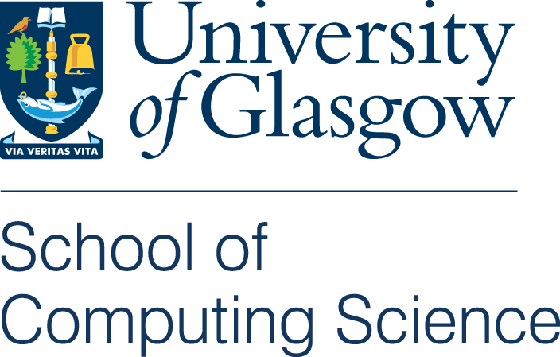
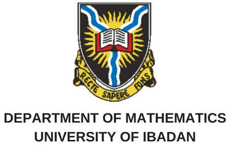

See this [page](https://www.gla.ac.uk/schools/computing/internationalpartners/internationaloutreach/) for the new workshop site.

## Workshop Infomation

This workshop is organised by research students at the School of Computing Science, University of Glasgow, led by [Sofiat Olaosebikan](http://www.dcs.gla.ac.uk/~sofiat/). The aim is to empower scientists at the University level in Africa with the programming tools needed to bridge the gap between theory and practice. For this year, we are looking to start off at the University of Ibadan in Nigeria, introducing the attendees to fundamental programming concepts needed for mathematical sciences.

## What am I going to learn?
The workshop, to be held from July 30 - August 10 2018, will cover an intensive two-week long curriculum designed to train participants on the essential programming skills needed for mathematical sciences. This will include variables, data types, data structures, loops, branching, functions, recursions, data handling, and usage of libraries (e.g., numpy, scipy, matplotlib, etc..) for mathematical computations and plotting, using the **Python programming language**. The format of the workshop will involve lectures and a lot of practical sessions, supported by a team of tutors. The workshop will also aim to give mathematical concepts context and relevance by exposing the participants to real-world applications arising from research which makes use of mathematical tools and computer programming.

## I am interested, what do I do next?
If you filled the [pre-workshop survey](https://goo.gl/forms/UoazzsG0OKm4va6f2), you will soon get an email regarding the workshop schedule.

## Code of Conduct
All workshop participants, tutors and instructors are required to agree with the workshop [code of conduct](assets/CoC.pdf).

## Who are we?
Tutors and instructors are all research students or staff at the School of Computing Science, University of Glasgow. We are passionate about programming, and we want to share the knowledge with others. This workshop is supported by the School of Computing Science, University of Glasgow, and the Department of Mathematics, University of Ibadan.

    
  

## Who can I contact for more information?
For questions or further information, you can contact any of the organisers by email:

Sofiat Olaosebikan (**s.olaosebikan.1 at research.gla.ac.uk**), Benjamin Bumpus (**benjamin.merlin.bumpus at gmail.com**), Fionnuala Johnson (**fionnualajohnson7 at gmail.com**).

Contact at the host University: Dr U.N. Bassey, HOD Mathematics (**unbassey at yahoo.com**), Mr Akeju (**aoakejuui at gmail.com**).
